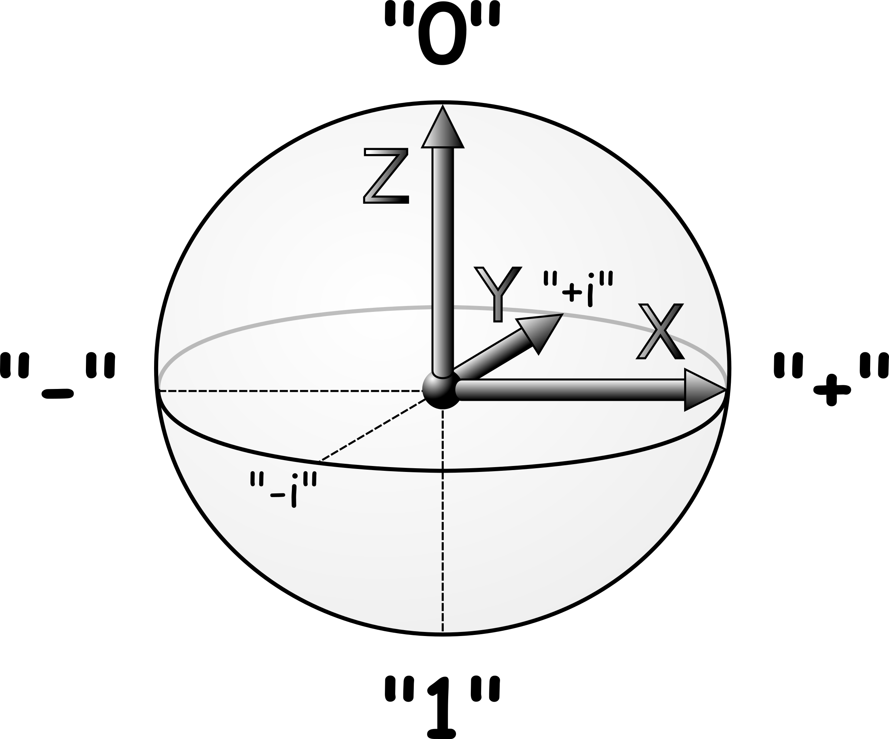

# Quantum Computing #

## Motivation ##

* es gibt inzwischen Quantum Computer
* für manche Aufgaben: exponentieller Speedup im Vergleich zu Turing Maschinen
* widerlegt Extended-Church-Turing Hypothese: "A probabilistic Turing machine can efficiently simulate any realistic model of computation."

* QC bleibt im Rahmen Church-Turing These
* NP wird nicht generell geknackt 

* Demo Shor QIO Haskell

## Perspektive Probabilistic Computing / Programming

* verallgemeinerte Wahrscheinlichkeitstheorie
* randomisierte Algorithmen (z.B. randomisierte Lineare Algebra)
* Machine Learning
* epistemische, ontische Aspekte

## Perspektive Haskell ##

* Domain Specific Language - Deep Embedding
* Typklassen
* explizite Seiteneffekte (QIO Monade)
* Sampling (run) und Berechnung Verteilung Messergebnisse (sim)

* <http://www.cs.nott.ac.uk/~psztxa/g5xnsc/chapter.pdf/>

### Timeline ###

* 1980 Benioff, Manin, Feynman (Quantum Simulation)
* 1984 Bennet, Brassard: BB84 (Quantum cryptography Protocol)
* 1993 Simon's problem: exponential speedup
* 1994 Shor's algorithm
* 1995 Shor: Quantum Error Correction
* 1995 Cirac, Zoller: Quantum Computations with Cold Trapped Ions (Theory)
* 1998 Jones, Mosca: First experimental demonstration of a quantum algorithm 
* 2007 D-Wave: quantum annealing computer
* 2018 Ewin Tang: A quantum-inspired classical algorithm for recommendation systems 
* 2019+ Sycamore, Jiuzhang: Quantum Advantage?
* [2022:Quantum computational advantage via high-dimensional Gaussian boson sampling](https://www.science.org/doi/full/10.1126/sciadv.abi7894)

"QCA will not be marked by a single isolated experiment but rather will be established by gradually improving and scaling up “high complexity” experiments run over the course of many years, which improving classical algorithms will try to simulate."

## Bits ##

* c-bit 
* b-bit 
* p-bit 
* qubit

### klassisches Bit ###

* entweder 0 oder 1
* Not Gate

### Bayes Bit ###

Ein Bayes Bit ist ein noch nicht gemessenes klassisches Bit.
(noch nicht geworfene oder noch nicht gezeigte Münze)

Demo: Lernen der Wahrscheinlichkeitsverteilung eines Münzwurfes (Bayes, beta distribution)

[Probability Simplex](https://i.stack.imgur.com/pJCTO.jpg)

### p-bit ###

Ein p-bit ist ein fluktuierendes Bit: <https://www.purdue.edu/p-bit/>.

Die Wahrscheinlichkeitsverteilung hat im Gegensatz zum Bayes Bit eine physikalische Entsprechung.

* probabilistische Berechnungen sind möglich
* kein exponenentieller Speedup

### qubit ###

* Superposition

* α|0〉 + β|1〉

* relative Phase

* Bloch Sphere

* 

* 

* Pauli-Matrizen

* 

* Quelle: <https://github.com/cduck/>

## Exponentieller Zustandsraum ##

### kombinatorische Explosion ###

n bits stellen 2^n Zahlen/Kombinationen dar

Das ermöglicht für viele Aufgaben (Additon, Multiplikation, ...) einen exponentiellen Speedup im Vergleich zur unären Darstellung.

### Joint Probability, Tensorprodukt ###

Die Komplexität der Joint Probability von n bits wächst exponentiell. Für jede Bit-Kombination ist ein Wahrscheinlichkeitswert definiert.

Das gilt entsprechend für qubits: die Dimension des Tensorprodukts von n qubits wächst exponentiell.

### Entanglement, Korrelation ###

* α|00〉 + β|11〉
* Messung des ersten Bits beeinflusst Messung des zweiten Bits (EPR)
* Entangled Bits haben keinen pure state
* Marginalisierung/Partial Trace -> Mixed State
* Mixed State: Quanten- und klassische Wahrscheinlichkeit sind verwoben
* (Density Matrix, Operatoralgebren, GPT, ...)

## Quantum Parallelism

* siehe linear.ipynb

## Techniken und Möglichkeiten ##

* Probabilistic Graphical Model
* Tensor Network
* [The graphical calculus of PGMs and TNs exhibits many similarities](https://tensorworkshop.github.io/NeurIPS2021/accepted_papers/main.pdf)
* ... (Quantum Funktor)

## QIO Tour ##

* Examples
* Syntax Monade
* Matrizen, Unitaries
* Klassiche Wahrscheinlichkeitsmonade
* Pure Quantum State Monade
* Runtime: run und sim
* Measurement/Split

### Ausblick Funktionales Quantum Computing ###

siehe quantum-abstractions.md

