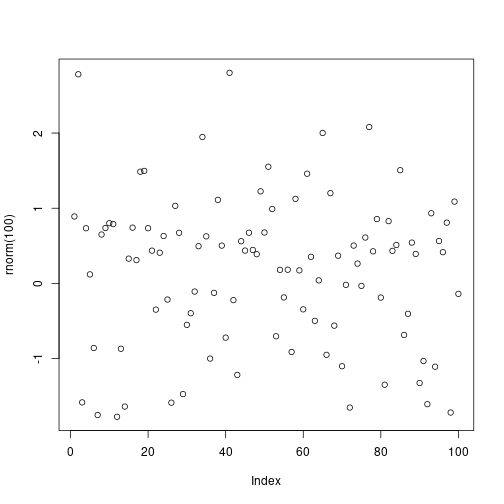
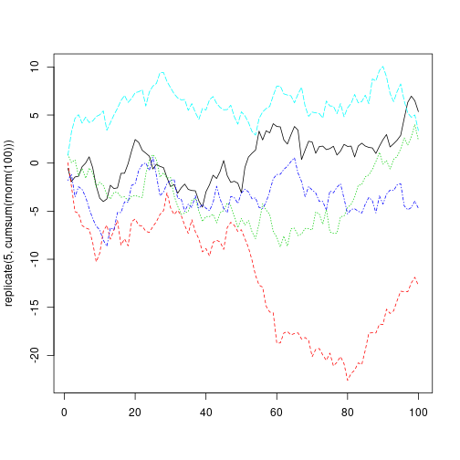
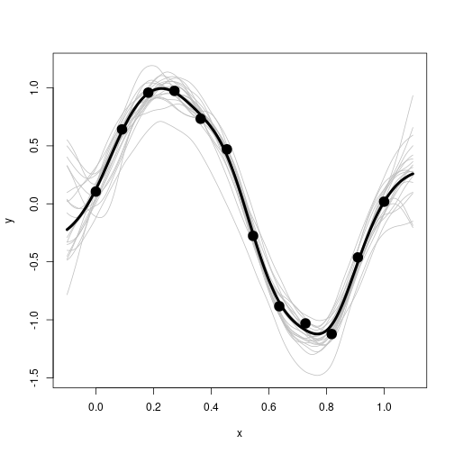

Gaußprozesse und probabilistisches Programmieren in R
========================================================
author: Christoph Schmalhofer
date: 2019-09-17
autosize: true

Gaußprozesse sind überall
========================================================


Wahrscheinlichkeitsverteilung von Funktionen

Bayes: Daten -> A-posteriori Gaußprozess


Anwendungsbeispiele
========================================================

- Bayes Optimization (Dateneffizienz)
- Zeitreihen
- Nachrichtentechnik
- Geostatistik


(NCAR fields package)

Interpolation
========================================================
- Bayes Posterior versus Konfidenzintervall

```r
library(ggplot2)
n=10
x<-1:n
y<-x + rnorm(n)
ggplot(data=data.frame(x,y), aes(x=x,y=y)) + geom_point() + geom_smooth(method="loess", level=0.99, span=0.6)
```


- Splines 

  https://stats.stackexchange.com/questions/144634/splines-vs-gaussian-process-regression
  
Einfache Gaußprozesse
========================================================

- Weißes gaußsches Rauschen
- Lineares Modell 
- Random Walk
- Ornstein-Uhlenbeck


Weißes gaußsches Rauschen
========================================================

```r
plot(rnorm(100))
```



Lineares Modell
========================================================


```r
plot(1:100 + rnorm(100, sd=5))
```


Random Walk I
========================================================

```r
plot(cumsum(rnorm(100)))
```


Random Walk II
========================================================


```r
matplot(replicate(5, cumsum(rnorm(100))), type="l")
```



Ornstein-Uhlenbeck
=====================================================

```r
#https://quant.stackexchange.com/questions/1260/r-code-for-ornstein-uhlenbeck-process
ornstein_uhlenbeck <- function(T, n, x0, nu, lambda, sigma){
dw  <- rnorm(n, 0, sqrt(T/n))
dt  <- T/n
x <- c(x0)
for (i in 2:(n+1)) {
x[i]  <-  x[i-1] + lambda*(nu-x[i-1])*dt + sigma*dw[i-1]
}
return(x);
}
```

x0: Startwert

nu: Attraktor 

lambda: Attraktionskraft

Ornstein-Uhlenbeck (Plot)
========================================================


```r
plot(ornstein_uhlenbeck(T=2,n=1000,x0=5,nu=0,lambda=2,sigma=0.5))
```


- https://math.stackexchange.com/questions/2292050/how-is-the-ornstein-uhlenbeck-process-stationary-if-the-mean-and-variance-are-ti

Gaußprozess Definition
========================================================

- f ~ GP( mu(x), k(x1, x2) )
- jede Teilmenge ist multivariat normal verteilt
- Erwartungswert: mu(x) 
- Kovarianz: k(x1, x2)

- Kovarianz schränkt Art der Funktionen ein 


Multivariate Normalverteilung 
========================================================

-korrellierte Normalverteilungen

-der zweite Schritt ist mit dem ersten schwach korreliert


```r
steps <- data.frame(t(replicate(1000, cumsum(rnorm(100)))))
ggplot(data=steps, aes(x=X1, y=X2)) + geom_density_2d() + coord_fixed()
```


(Simulation 1000 Random Walks)


Multivariate Normalverteilung 99 Schritte
========================================================

-korrellierte Normalverteilungen

-Schritt 99 ist stark mit Schritt 98 korelliert


```r
ggplot(data=steps, aes(x=X98, y=X99)) + geom_point() + coord_fixed()
```


Multivariate Normalverteilung Eigenschaften
========================================================

- Die marginalen Verteilungen sind immer normal

- Konditionierung einer Dimension -> restliche Dimensionen bleiben normalverteilt 

  A-posteriori bleibt also Gaußprozess

- Summen bzw. Linearkombinationen bleiben normalverteilt


```r
plot(density(rnorm(1000, mean=1) + 2*rnorm(1000, mean=2)))
```


Multivariate Normalverteilung Persp unkorreliert
========================================================


```r
m = diag(2)
# vektorisiert, nicht normiert
e2 <- function(x,y) exp(-rowSums((cbind(x,y) %*% solve(m) * cbind(x,y))))
#
x <- y<- seq(-4,4, length.out=100)
persp(x=x, y=y, z=outer(x, y, function(a,b) e2(a,b)))
```


- plotly interaktiv -> Projekt gaussian


Multivariate Normalverteilung Persp korreliert
========================================================


```r
# plotly interaktiv -> Projekt gaussian

m=rbind(c(1.1,0.5), c(0.5,3.1))

persp(x=x, y=y, z=outer(x, y, function(a,b) e2(a,b)))
```


Kovarianzfunktionen der Beispiele
========================================================
- weißes Rauschen

  k(x_i, x_j) = kronecker(i, j)

- Random Walk

  k(x1, x2) = min(x1, x2 ) (Einstein 1905)

- Ornstein-Uhlenbeck

  k(x1, x2) = .....


Kovarianzfunktionen
========================================================

- squared exponential, gaussian, rbf

  k(x1,x2) = sigma^2 * exp(-(x1-x2)^2 / 2*length^2 )
  
  homogen, isotrop, sehr glatt, length bestimmt Reichweite
  
- periodisch

- linear

- Duvenaud: Kernel Cookbook

  Murphy: Kapitel 14

- Raum für Kreativität

Gaußprozess Inferenz
========================================================

- multivariate Gaußverteilung sind sehr gutartig

-  Formeln für Posterior mu und Kovarianz (keine wilden Integrale)
  
- Kovarianz Formel mit Matrix Inverse -> kubische Komplexität

- Murphy: Kapitel 4

Inferenz mit GauPro 
========================================================


```r
library(GauPro)
n <- 12
x <- matrix(seq(0,1,length.out = n), ncol=1)
y <- sin(2*pi*x) + rnorm(n,0,1e-1)
gp <- GauPro::GauPro(X=x, Z=y)
curve(gp$pred(x));points(x,y)
```


GauPro Matern Kernel
========================================================


```r
kern <- Matern52$new(0)
gpk <- GauPro_kernel_model$new(matrix(x, ncol=1), y, kernel=kern, parallel=FALSE)
plot(gpk)
```




Zufallsvariablen -> zufällige Funktion
========================================================

- Wiener, Kolmogoroff in etwa 1930: 

 Wahrscheinlichkeitsverteilung über Funktionen
 
 (Kolmogorov consistency/extension theorem)
 
- Heunen, Kammar, Staton, Yang: 

  "But standard probability theory cannot support higher-order functions, that is, the category of measurable spaces is not cartesian closed"

Zufällige Funktionen in R 
================================================

```r
library(functional)
# linarr: n Werte einer Gerade a + b*x (im Intervall [0,1])
linarr <- function(n,a,b) a + b * seq(0, 1, length.out = n)

# mk_lin_ab erzeugt Closure (a und b gefangen, n bleibt frei)
mk_lin_ab <- function(a,b) Curry(linarr, a=a, b=b)

#Liste von 5 zufälligen linearen Funktionen (Non Standard Evaluation)
random_lins = replicate(5,mk_lin_ab(runif(1), runif(1, min=0.8, max=1.2)))

# Wrapper für dynamischen Funktionsaufruf mit einen Parameter
call_with_n <- function(n) Curry(do.call, args=list(n))

twenty_values_each <- sapply(random_lins, call_with_n(20))
```


Zufällige Funktionen in R (Plot)
================================================

```r
matplot(twenty_values_each, type="l")
```


Stan Linear Model
========================================================


```r
library(rstan)
options(mc.cores = parallel::detectCores())
rstan_options(auto_write = TRUE)

library(rstanarm)
n = 100
x <- 1:n
y <-  12 + 4*x + rnorm(n, sd=13)
plot(y)
```


Stan Linear Model Fit 
========================================================

```r
fit <- stan_lm( y ~ x, prior = R2(location = 0.5, what="mean"), chains=1)
```

```

SAMPLING FOR MODEL 'lm' NOW (CHAIN 1).
Chain 1: 
Chain 1: Gradient evaluation took 1.2e-05 seconds
Chain 1: 1000 transitions using 10 leapfrog steps per transition would take 0.12 seconds.
Chain 1: Adjust your expectations accordingly!
Chain 1: 
Chain 1: 
Chain 1: Iteration:    1 / 2000 [  0%]  (Warmup)
Chain 1: Iteration:  200 / 2000 [ 10%]  (Warmup)
Chain 1: Iteration:  400 / 2000 [ 20%]  (Warmup)
Chain 1: Iteration:  600 / 2000 [ 30%]  (Warmup)
Chain 1: Iteration:  800 / 2000 [ 40%]  (Warmup)
Chain 1: Iteration: 1000 / 2000 [ 50%]  (Warmup)
Chain 1: Iteration: 1001 / 2000 [ 50%]  (Sampling)
Chain 1: Iteration: 1200 / 2000 [ 60%]  (Sampling)
Chain 1: Iteration: 1400 / 2000 [ 70%]  (Sampling)
Chain 1: Iteration: 1600 / 2000 [ 80%]  (Sampling)
Chain 1: Iteration: 1800 / 2000 [ 90%]  (Sampling)
Chain 1: Iteration: 2000 / 2000 [100%]  (Sampling)
Chain 1: 
Chain 1:  Elapsed Time: 0.204227 seconds (Warm-up)
Chain 1:                0.068595 seconds (Sampling)
Chain 1:                0.272822 seconds (Total)
Chain 1: 
```

Stan Linear Model Summary 
========================================================


```r
summary(fit)
```

```

Model Info:

 function:     stan_lm
 family:       gaussian [identity]
 formula:      y ~ x
 algorithm:    sampling
 priors:       see help('prior_summary')
 sample:       1000 (posterior sample size)
 observations: 100
 predictors:   2

Estimates:
                mean   sd     2.5%   25%    50%    75%    97.5%
(Intercept)     12.9    2.3    8.3   11.3   13.0   14.5   17.5 
x                4.0    0.0    3.9    4.0    4.0    4.0    4.1 
sigma           11.8    0.8   10.3   11.3   11.8   12.4   13.5 
log-fit_ratio    0.0    0.0    0.0    0.0    0.0    0.0    0.0 
R2               1.0    0.0    1.0    1.0    1.0    1.0    1.0 
mean_PPD       215.0    1.6  211.7  213.9  215.0  216.0  218.3 
log-posterior -392.1    1.2 -395.2 -392.6 -391.8 -391.3 -390.8 

Diagnostics:
              mcse Rhat n_eff
(Intercept)   0.1  1.0   439 
x             0.0  1.0   337 
sigma         0.0  1.0   451 
log-fit_ratio 0.0  1.0   342 
R2            0.0  1.0   450 
mean_PPD      0.1  1.0  1029 
log-posterior 0.1  1.0   328 

For each parameter, mcse is Monte Carlo standard error, n_eff is a crude measure of effective sample size, and Rhat is the potential scale reduction factor on split chains (at convergence Rhat=1).
```

Stan Linear Model Plot
========================================================


```r
plot(fit)
```


Stan Gaußprozess Modell (Stan Examples Project)
========================================================


```
// Fit the hyperparameters of a Gaussian process with an 
// exponentiated quadratic kernel

data {
  int<lower=1> N;
  real x[N];
  vector[N] y;
}
transformed data {
  vector[N] mu = rep_vector(0, N);
}
parameters {
  real<lower=0> rho;
  real<lower=0> alpha;
  real<lower=0> sigma;
}
model {
  matrix[N, N] L_K;
  matrix[N, N] K = cov_exp_quad(x, alpha, rho);
  real sq_sigma = square(sigma);

  // diagonal elements
  for (n in 1:N)
    K[n, n] = K[n, n] + sq_sigma;
  
  L_K = cholesky_decompose(K);
  
  rho ~ inv_gamma(5, 5);
  alpha ~ normal(0, 1);
  sigma ~ normal(0, 1);

  y ~ multi_normal_cholesky(mu, L_K);
}
```


Stan Gaußprozess Fit 
========================================================


```r
stan_dat <- read_rdump('gp-fit.data.R')

fit_gp <- stan(file="gp-fit.stan", data=stan_dat,
               iter=200, chains=1)
```

```

SAMPLING FOR MODEL 'gp-fit' NOW (CHAIN 1).
Chain 1: 
Chain 1: Gradient evaluation took 0.001261 seconds
Chain 1: 1000 transitions using 10 leapfrog steps per transition would take 12.61 seconds.
Chain 1: Adjust your expectations accordingly!
Chain 1: 
Chain 1: 
Chain 1: WARNING: There aren't enough warmup iterations to fit the
Chain 1:          three stages of adaptation as currently configured.
Chain 1:          Reducing each adaptation stage to 15%/75%/10% of
Chain 1:          the given number of warmup iterations:
Chain 1:            init_buffer = 15
Chain 1:            adapt_window = 75
Chain 1:            term_buffer = 10
Chain 1: 
Chain 1: Iteration:   1 / 200 [  0%]  (Warmup)
Chain 1: Iteration:  20 / 200 [ 10%]  (Warmup)
Chain 1: Iteration:  40 / 200 [ 20%]  (Warmup)
Chain 1: Iteration:  60 / 200 [ 30%]  (Warmup)
Chain 1: Iteration:  80 / 200 [ 40%]  (Warmup)
Chain 1: Iteration: 100 / 200 [ 50%]  (Warmup)
Chain 1: Iteration: 101 / 200 [ 50%]  (Sampling)
Chain 1: Iteration: 120 / 200 [ 60%]  (Sampling)
Chain 1: Iteration: 140 / 200 [ 70%]  (Sampling)
Chain 1: Iteration: 160 / 200 [ 80%]  (Sampling)
Chain 1: Iteration: 180 / 200 [ 90%]  (Sampling)
Chain 1: Iteration: 200 / 200 [100%]  (Sampling)
Chain 1: 
Chain 1:  Elapsed Time: 1.01937 seconds (Warm-up)
Chain 1:                0.898746 seconds (Sampling)
Chain 1:                1.91811 seconds (Total)
Chain 1: 
```

Stan Gaußprozess Print
========================================================


```r
print(fit_gp, pars = c('rho','alpha','sigma'))
```

```
Inference for Stan model: gp-fit.
1 chains, each with iter=200; warmup=100; thin=1; 
post-warmup draws per chain=100, total post-warmup draws=100.

      mean se_mean   sd 2.5%  25%  50%  75% 97.5% n_eff Rhat
rho   1.13    0.04 0.35 0.64 0.91 1.08 1.31  1.88    61 1.00
alpha 0.54    0.03 0.20 0.30 0.40 0.50 0.64  1.04    41 1.07
sigma 0.34    0.00 0.02 0.30 0.33 0.34 0.36  0.38   161 1.01

Samples were drawn using NUTS(diag_e) at Sat Sep 14 12:47:08 2019.
For each parameter, n_eff is a crude measure of effective sample size,
and Rhat is the potential scale reduction factor on split chains (at 
convergence, Rhat=1).
```

Stan Gaußprozess Plot
========================================================


```r
plot(fit_gp)
```


Referenzen 
========================================================


- David MacKay: Introduction to Gaussian Processes

  https://www.ics.uci.edu/~welling/teaching/KernelsICS273B/gpB.pdf
  
- Görtler, Jochen and Kehlbeck, Rebecca and Deussen, Oliver

  https://distill.pub/2019/visual-exploration-gaussian-processes/

  sehr coole interaktive Einführung
  

- Functional Neural Process

  https://arxiv.org/abs/1906.08324

Referenzen Gaußprozesse I
========================================================

  
- Andreas Damianou: Gaussian process lecture 

  https://nbviewer.jupyter.org/github/adamian/adamian.github.io/blob/master/talks/Brown2016.ipynb
  
- Richard Turner: "Introduction to Gaussian Processes"

  https://www.youtube.com/watch?v=Jv25sg-IYHU

- scikit-learn: GP zur Klassifizierung - Vergleich mit anderen Methoden

  https://scikit-learn.org/stable/auto_examples/classification/plot_classifier_comparison.html

- scikit-learn: Kernel Beispiele

  https://scikit-learn.org/stable/auto_examples/gaussian_process/plot_gpr_prior_posterior.html#sphx-glr-auto-examples-gaussian-process-plot-gpr-prior-posterior-py


Referenzen Gaußprozesse II
========================================================

- http://www.gaussianprocess.org/
  
  Rasmussen, Williams: "Gaussian Processes for Machine Learning"

- Kevin Murphy "Machine Learning: a Probabilistic Perspective"
  
  Kapitel 4, 14 und 15 

- David MacKay "Information Theory, Inference, and Learning Algorithms"
   
  Teil V: zeigt den Zusammenhang mit Neuronalen Netzen
  

Referenzen Gaußprozesse III
========================================================

- Michael Betancourt: wie robust sind Gaußprozess Regressionen

  https://betanalpha.github.io/assets/case_studies/gp_part1/part1.html
  
- Stan User's Guide

- Gaußprozesse in der Geostatistik
  
  https://github.com/NCAR/fields/blob/master/fieldsVignette.pdf

- David Duvenaud:"The Kernel Cookbook"

  https://www.cs.toronto.edu/~duvenaud/cookbook/

- GPyTorch: https://gpytorch.readthedocs.io/en/latest/


- https://docs.pymc.io/Gaussian_Processes.html
  
