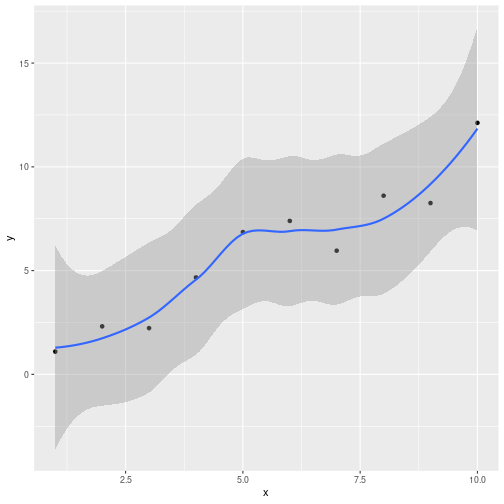
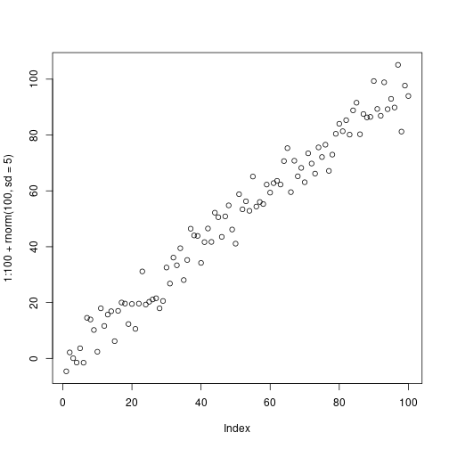
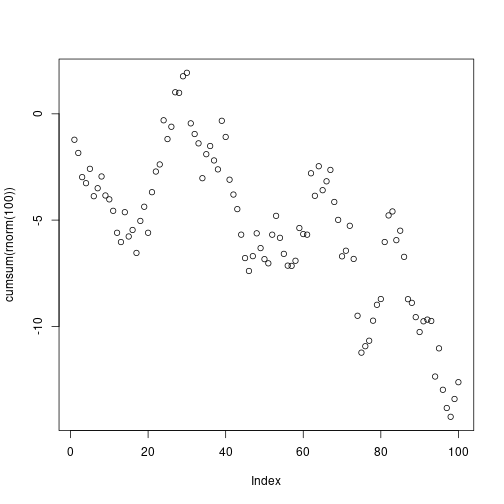
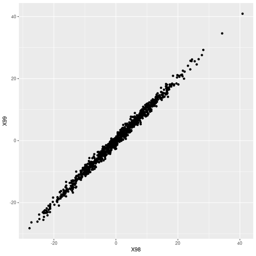

Gaußprozesse und probabilistisches Programmieren in R
========================================================
author: Christoph Schmalhofer
date: 2019-09-17
autosize: true

Gaußprozesse sind überall
========================================================


Wahrscheinlichkeitsverteilung von Funktionen

Bayes: Daten -> A-posteriori Gaußprozess


Anwendungsbeispiele
========================================================

- Bayes Optimization (Dateneffizienz)
- Zeitreihen
- Nachrichtentechnik
- Geostatistik


(NCAR fields package)

Interpolation
========================================================
- Bayes Posterior versus Konfidenzintervall

```r
library(ggplot2)
n=10
x<-1:n
y<-x + rnorm(n)
ggplot(data=data.frame(x,y), aes(x=x,y=y)) + geom_point() + geom_smooth(method="loess", level=0.99, span=0.6)
```



Einfache Gaußprozesse
========================================================

- Weißes gaußsches Rauschen
- Lineares Modell 
- Random Walk
- Ornstein-Uhlenbeck


Weißes gaußsches Rauschen
========================================================

```r
plot(rnorm(100))
```


Lineares Modell
========================================================


```r
plot(1:100 + rnorm(100, sd=5))
```



Random Walk I
========================================================

```r
plot(cumsum(rnorm(100)))
```



Random Walk II
========================================================


```r
matplot(replicate(5, cumsum(rnorm(100))), type="l")
```


Ornstein-Uhlenbeck
=====================================================

```r
#https://quant.stackexchange.com/questions/1260/r-code-for-ornstein-uhlenbeck-process
ornstein_uhlenbeck <- function(T,n, x0,nu,lambda,sigma){
dw  <- rnorm(n, 0, sqrt(T/n))
dt  <- T/n
x <- c(x0)
for (i in 2:(n+1)) {
x[i]  <-  x[i-1] + lambda*(nu-x[i-1])*dt + sigma*dw[i-1]
}
return(x);
}
```

T: Dauer

n:Anzahl Werte

x0: Startwert

nu: Attraktor

lambda: Attraktionskraft

sigma: Varianz

Ornstein-Uhlenbeck (Plot)
========================================================


```r
plot(ornstein_uhlenbeck(T=2,n=1000,x0=5,nu=0,lambda=2,sigma=0.5))
```


Zufallsvariablen -> zufällige Funktion
========================================================

- Wiener, Kolmogoroff in etwa 1930: 

 Wahrscheinlichkeitsverteilung über Funktionen
 
 (Kolmogorov consistency/extension theorem)
 
- Heunen, Kammar, Staton, Yang: 

  "But standard probability theory cannot support higher-order functions, that is, the category of measurable spaces is not cartesian closed"

Zufällige Funktionen in R 
================================================

```r
library(functional)
# linarr: n Werte einer Gerade a + b*x (im Intervall [0,1])
linarr <- function(n,a,b) a + b * seq(0, 1, length.out = n)

# mk_lin_ab erzeugt Closure (a und b gefangen, n bleibt frei)
mk_lin_ab <- function(a,b) Curry(linarr, a=a, b=b)

#Liste von 5 zufälligen linearen Funktionen (Non Standard Evaluation)
random_lins = replicate(5,mk_lin_ab(runif(1), runif(1, min=0.8, max=1.2)))

# Wrapper für dynamischen Funktionsaufruf mit einen Parameter
call_with_n <- function(n) Curry(do.call, args=list(n))

twenty_values_each <- sapply(random_lins, call_with_n(20))
```

(Vergleich: stan_lm)

Zufällige Funktionen in R (Plot)
================================================

```r
matplot(twenty_values_each, type="l")
```




Multivariate Normalverteilung I
========================================================

-korrellierte Normalverteilungen

-der zweite Schritt ist mit dem ersten schwach korreliert


```r
library(ggplot2)
steps <- data.frame(t(replicate(1000, cumsum(rnorm(100)))))
ggplot(data=steps, aes(x=X1, y=X2)) + geom_density_2d() + coord_fixed()
```


(Simulation 1000 Random Walks)


Multivariate Normalverteilung II
========================================================

-korrellierte Normalverteilungen

-Schritt 99 ist stark mit Schritt 98 korelliert


```r
library(ggplot2)
ggplot(data=steps, aes(x=X98, y=X99)) + geom_point() + coord_fixed()
```


Multivariate Normalverteilung III
========================================================

- Die marginalen Verteilungen sind immer normal

- Konditionierung einer Dimension -> restliche Dimensionen bleiben normalverteilt 

  A-posteriori bleibt also Gaußprozess

- Summen bzw. Linearkombinationen bleiben normalverteilt


```r
plot(density(rnorm(1000, mean=1) + 2*rnorm(1000, mean=2)))
```


Multivariate Normalverteilung Persp I
========================================================


```r
# plotly interaktiv -> Projekt gaussian
m = diag(2)
# vektorisiert, nicht normiert
e2 <- function(x,y) exp(-rowSums((cbind(x,y) %*% solve(m) * cbind(x,y))))
#
x <- y<- seq(-4,4, length.out=100)
persp(x=x, y=y, z=outer(x, y, function(a,b) e2(a,b)))
```


Multivariate Normalverteilung Persp II
========================================================


```r
# plotly interaktiv -> Projekt gaussian

m=rbind(c(1.1,0.5), c(0.5,3.1))

persp(x=x, y=y, z=outer(x, y, function(a,b) e2(a,b)))
```


Referenzen Gaußprozesse I
========================================================

- Görtler, Jochen and Kehlbeck, Rebecca and Deussen, Oliver

  https://distill.pub/2019/visual-exploration-gaussian-processes/

  sehr coole interaktive Einführung
  
  weiterführende Literaturhinweise (z.B. Deep Kernel Learning)
  
- Andreas Damianou: Gaussian process lecture 

  https://nbviewer.jupyter.org/github/adamian/adamian.github.io/blob/master/talks/Brown2016.ipynb
  
- Richard Turner: "Introduction to Gaussian Processes"

  https://www.youtube.com/watch?v=Jv25sg-IYHU

- scikit-learn: GP zur Klassifizierung - Vergleich mit anderen Methoden

  https://scikit-learn.org/stable/auto_examples/classification/plot_classifier_comparison.html

- scikit-learn: Kernel Beispiele

  https://scikit-learn.org/stable/auto_examples/gaussian_process/plot_gpr_prior_posterior.html#sphx-glr-auto-examples-gaussian-process-plot-gpr-prior-posterior-py


Referenzen Gaußprozesse II
========================================================

- http://www.gaussianprocess.org/
  
  Rasmussen, Williams: "Gaussian Processes for Machine Learning"

- Kevin Murphy "Machine Learning: a Probabilistic Perspective"
  
  Kapitel 14 und 15 

- David MacKay "Information Theory, Inference, and Learning Algorithms"
   
  Teil V: zeigt den Zusammenhang mit Neuronalen Netzen
  
- 
Referenzen Gaußprozesse III
========================================================

- Michael Betancourt: wie robust sind Gaußprozess Regressionen

  https://betanalpha.github.io/assets/case_studies/gp_part1/part1.html
  
-  Stan User's Guide

- Gaußprozesse in der Geostatistik
  
  https://github.com/NCAR/fields/blob/master/fieldsVignette.pdf

- David Duvenaud:"The Kernel Cookbook"

  https://www.cs.toronto.edu/~duvenaud/cookbook/

- GPyTorch: https://gpytorch.readthedocs.io/en/latest/


  
